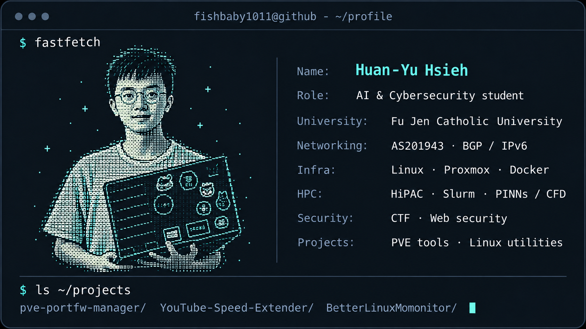

<!-- fishbaby1011 / personal profile -->

  

I'm **Huan-Yu Hsieh** (`fishbaby1011`), an AI & Cybersecurity student at Fu Jen Catholic University in Taiwan. I like learning how systems work by building, breaking, and maintaining them.

I operate **[AS201943](https://stat.ripe.net/AS201943)** to explore BGP and IPv6 in practice, run my own Linux / Proxmox homelab, and work with Slurm and GPU clusters through HPC training and competitions.

### `$ ls ~/projects`

- **[pve-portfw-manager](https://github.com/fishbaby1011/pve-portfw-manager)** — A port-forwarding manager for Proxmox VE, with an unprivileged LXC panel, restricted host helper, and nftables safeguards.
- **[YouTube-Speed-Extender](https://github.com/fishbaby1011/YouTube-Speed-Extender)** — A browser extension for more precise playback-speed control.
- **[BetterLinuxMomonitor](https://github.com/fishbaby1011/BetterLinuxMomonitor)** — A small Bash resource monitor with Discord webhook alerts.

### `$ cat ~/currently.txt`

Learning more about network operations and web security, improving my homelab tooling, and experimenting with GPU computing.

[**Blog**](https://blog.fishbaby1011.com/) · [**LinkedIn**](https://www.linkedin.com/in/fishbaby1011/) · [**AS201943**](https://stat.ripe.net/AS201943)
